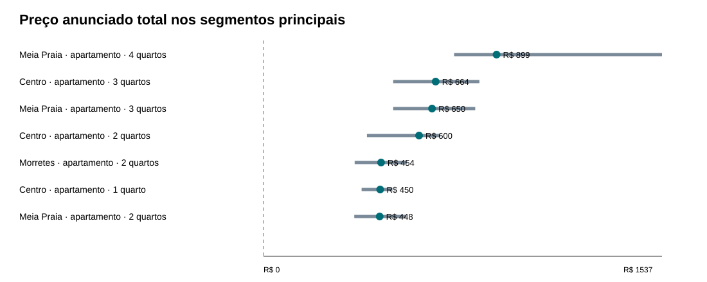
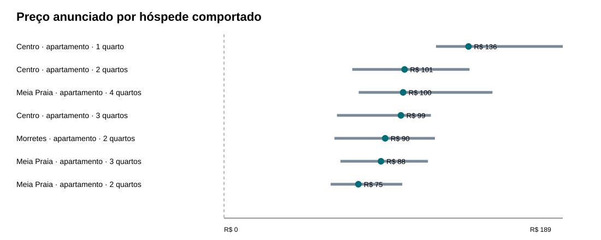
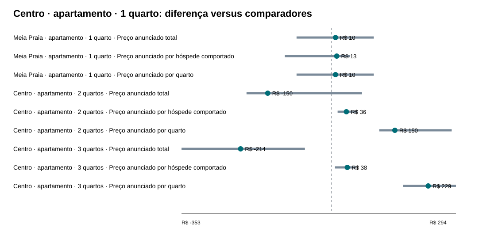

# Ciclo 2 — perfil, localização e tese operacional

## Conclusão operacional

**A tese dos apartamentos de um quarto no Centro foi classificada como parcialmente sustentada.**

O componente de localização ficou **inconclusivo**. O componente de compacto ficou **favorável apenas em densidade de preço anunciado por capacidade declarada**. Esta é uma conclusão somente sobre preços anunciados; não incorpora compra, demanda, ocupação, receita realizada ou retorno.

## Perfil com maior preço anunciado total

Entre os segmentos principais cobertos em 20/01, **Meia Praia · apartamento · 4 quartos** tem a maior mediana pontual (R$ 899; n=43 listings e 38 anfitriões). O comparador controlado principal mais próximo disponível é **Meia Praia · apartamento · 3 quartos**: diferença de R$ 249 (38,3%), com intervalo agrupado por anfitrião de R$ 150 a R$ 713. Evidência: **diferença estatisticamente sustentada**. O segundo colocado geral não é usado como contraste causalmente interpretável quando perfil e bairro mudam juntos.

| Segmento de imóveis | Listings | Hosts | Mediana | p25 | p75 |
|---|---|---|---|---|---|
| Meia Praia · apartamento · 4 quartos | 43 | 38 | R$ 899,0 | R$ 735,0 | R$ 1.537,0 |
| Centro · apartamento · 3 quartos | 38 | 34 | R$ 664,0 | R$ 500,0 | R$ 832,8 |
| Meia Praia · apartamento · 3 quartos | 284 | 235 | R$ 650,0 | R$ 500,0 | R$ 816,5 |
| Centro · apartamento · 2 quartos | 59 | 37 | R$ 600,0 | R$ 399,0 | R$ 682,0 |
| Morretes · apartamento · 2 quartos | 43 | 34 | R$ 453,5 | R$ 351,5 | R$ 553,8 |
| Centro · apartamento · 1 quarto | 75 | 17 | R$ 450,0 | R$ 378,2 | R$ 497,0 |
| Meia Praia · apartamento · 2 quartos | 126 | 112 | R$ 448,0 | R$ 350,0 | R$ 550,0 |

## Perfil em relação à capacidade declarada

**Centro · apartamento · 1 quarto** apresenta a maior mediana de preço anunciado por hóspede comportado entre os segmentos principais (R$ 136,5). O mesmo segmento também lidera o preço anunciado por quarto (R$ 450,0). Como possui um quarto, seu preço por quarto é numericamente igual ao preço total; a informação analítica vem da comparação dessa razão com imóveis de mais quartos. Essas divisões medem somente densidade de preço anunciado por capacidade declarada: não demonstram demanda, ocupação, receita, retorno nem eficiência por área ou capital. A divisão por quarto pode favorecer mecanicamente imóveis menores porque reduz o denominador.

| Segmento de imóveis | Listings | Hosts | Mediana por hóspede | p25 | p75 |
|---|---|---|---|---|---|
| Centro · apartamento · 1 quarto | 75 | 17 | R$ 136,5 | R$ 118,3 | R$ 189,1 |
| Centro · apartamento · 2 quartos | 59 | 37 | R$ 100,8 | R$ 71,6 | R$ 137,1 |
| Meia Praia · apartamento · 4 quartos | 43 | 38 | R$ 100,0 | R$ 75,2 | R$ 149,9 |
| Centro · apartamento · 3 quartos | 38 | 34 | R$ 98,8 | R$ 63,1 | R$ 115,5 |
| Morretes · apartamento · 2 quartos | 43 | 34 | R$ 90,0 | R$ 61,7 | R$ 117,8 |
| Meia Praia · apartamento · 3 quartos | 284 | 235 | R$ 87,6 | R$ 65,0 | R$ 113,9 |
| Meia Praia · apartamento · 2 quartos | 126 | 112 | R$ 75,0 | R$ 59,5 | R$ 99,5 |

## Localização com perfil controlado

**Não há base para declarar um bairro vencedor em termos gerais.** Nenhum par de bairros satisfez simultaneamente dois perfis equivalentes principais, direção coerente e diferenças sustentadas. A resposta de localização permanece condicionada ao perfil.
No contraste pré-definido de apartamentos de um quarto, Centro tem R$ 450 contra R$ 440 em Meia Praia: R$ 10 (2,3%), IC95 agrupado de R$ -82 a R$ 100; no ajuste de calendário, a diferença muda para R$ -12 (-2,6%). O comparador tem apenas 16 listings, portanto a leitura é exploratória e inconclusiva.

| Bairro A | Bairro B | Perfil equivalente | n A | n B | A − B | % sobre B | Evidência |
|---|---|---|---|---|---|---|---|
| Centro | Meia Praia | apartamento · 2 quartos | 59 | 126 | R$ 152,0 | 33,9% | evidência inconclusiva |
| Centro | Meia Praia | apartamento · 3 quartos | 38 | 284 | R$ 14,0 | 2,2% | evidência inconclusiva |
| Centro | Morretes | apartamento · 2 quartos | 59 | 43 | R$ 146,5 | 32,3% | evidência inconclusiva |
| Meia Praia | Morretes | apartamento · 2 quartos | 126 | 43 | R$ -5,5 | -1,2% | evidência inconclusiva |

## Contrastes pré-definidos da tese

| Componente | Comparador de Centro/1 quarto | Métrica | n alvo | hosts alvo | n comp. | hosts comp. | Mediana alvo | Mediana comp. | Diferença | % sobre comp. | IC95 inf. | IC95 sup. | Evidência | Suporte |
|---|---|---|---|---|---|---|---|---|---|---|---|---|---|---|
| tese: vantagem de localização | Meia Praia · apartamento · 1 quarto | Preço anunciado por hóspede comportado | 75 | 17 | 16 | 14 | R$ 136,5 | R$ 123,8 | R$ 12,8 | 10,3% | R$ -109,8 | R$ 43,6 | evidência inconclusiva | exploratório |
| tese: vantagem de localização | Meia Praia · apartamento · 1 quarto | Preço anunciado por quarto | 75 | 17 | 16 | 14 | R$ 450,0 | R$ 440,0 | R$ 10,0 | 2,3% | R$ -82,0 | R$ 100,0 | evidência inconclusiva | exploratório |
| tese: vantagem de localização | Meia Praia · apartamento · 1 quarto | Preço anunciado total | 75 | 17 | 16 | 14 | R$ 450,0 | R$ 440,0 | R$ 10,0 | 2,3% | R$ -82,0 | R$ 100,0 | evidência inconclusiva | exploratório |
| tese: vantagem do compacto | Centro · apartamento · 2 quartos | Preço anunciado por hóspede comportado | 75 | 17 | 59 | 37 | R$ 136,5 | R$ 100,8 | R$ 35,7 | 35,4% | R$ 15,0 | R$ 61,9 | diferença estatisticamente sustentada | principal |
| tese: vantagem do compacto | Centro · apartamento · 2 quartos | Preço anunciado por quarto | 75 | 17 | 59 | 37 | R$ 450,0 | R$ 300,0 | R$ 150,0 | 50,0% | R$ 113,1 | R$ 284,0 | diferença estatisticamente sustentada | principal |
| tese: vantagem do compacto | Centro · apartamento · 2 quartos | Preço anunciado total | 75 | 17 | 59 | 37 | R$ 450,0 | R$ 600,0 | R$ -150,0 | -25,0% | R$ -200,0 | R$ 71,8 | evidência inconclusiva | principal |
| tese: vantagem do compacto | Centro · apartamento · 3 quartos | Preço anunciado por hóspede comportado | 75 | 17 | 38 | 34 | R$ 136,5 | R$ 98,8 | R$ 37,7 | 38,2% | R$ 8,3 | R$ 58,5 | diferença estatisticamente sustentada | principal |
| tese: vantagem do compacto | Centro · apartamento · 3 quartos | Preço anunciado por quarto | 75 | 17 | 38 | 34 | R$ 450,0 | R$ 221,3 | R$ 228,7 | 103,3% | R$ 169,0 | R$ 294,3 | diferença estatisticamente sustentada | principal |
| tese: vantagem do compacto | Centro · apartamento · 3 quartos | Preço anunciado total | 75 | 17 | 38 | 34 | R$ 450,0 | R$ 664,0 | R$ -214,0 | -32,2% | R$ -353,3 | R$ -62,2 | diferença estatisticamente sustentada | principal |

O componente compacto é favorável **apenas em densidade de preço anunciado por capacidade declarada**: Centro/1 quarto supera Centro/2 e Centro/3 quartos tanto por hóspede comportado quanto por quarto, com intervalos agrupados acima de zero e sinal preservado nas sensibilidades. Em preço total ocorre o conflito esperado: Centro/1 quarto fica R$ 150 abaixo de Centro/2 quartos, com evidência inconclusiva, e R$ 214 abaixo de Centro/3 quartos, com diferença sustentada. A tese não exigia preço total superior, e essas razões não demonstram desempenho econômico ou demanda.

O preço total e as métricas por capacidade são leituras diferentes. Quando apontam em direções distintas, o resultado acima preserva o conflito: o preço total mede o valor anunciado da unidade; as razões medem esse preço em relação à capacidade declarada.

## Comparações com suporte principal e diferença sustentada

Das 30 comparações com pelo menos 30 listings nos dois lados, 10 têm intervalo agrupado que exclui zero. Fora dos contrastes pré-definidos da tese, essas leituras permanecem exploratórias quanto à formulação de conclusões gerais; as demais diferenças são inconclusivas.

| Segmento A | Segmento B | Métrica | A − B | % sobre B | IC95 inf. | IC95 sup. |
|---|---|---|---|---|---|---|
| Meia Praia · apartamento · 2 quartos | Meia Praia · apartamento · 3 quartos | Preço anunciado por hóspede comportado | R$ -12,6 | -14,4% | R$ -21,0 | R$ -5,6 |
| Meia Praia · apartamento · 2 quartos | Meia Praia · apartamento · 3 quartos | Preço anunciado total | R$ -202,0 | -31,1% | R$ -295,0 | R$ -155,7 |
| Meia Praia · apartamento · 2 quartos | Meia Praia · apartamento · 4 quartos | Preço anunciado por hóspede comportado | R$ -25,0 | -25,0% | R$ -57,2 | R$ -7,6 |
| Meia Praia · apartamento · 2 quartos | Meia Praia · apartamento · 4 quartos | Preço anunciado total | R$ -451,0 | -50,2% | R$ -952,3 | R$ -379,0 |
| Meia Praia · apartamento · 3 quartos | Meia Praia · apartamento · 4 quartos | Preço anunciado total | R$ -249,0 | -27,7% | R$ -712,7 | R$ -150,0 |
| Centro · apartamento · 1 quarto | Centro · apartamento · 2 quartos | Preço anunciado por hóspede comportado | R$ 35,7 | 35,4% | R$ 15,0 | R$ 61,9 |
| Centro · apartamento · 1 quarto | Centro · apartamento · 2 quartos | Preço anunciado por quarto | R$ 150,0 | 50,0% | R$ 113,1 | R$ 284,0 |
| Centro · apartamento · 1 quarto | Centro · apartamento · 3 quartos | Preço anunciado por hóspede comportado | R$ 37,7 | 38,2% | R$ 8,3 | R$ 58,5 |
| Centro · apartamento · 1 quarto | Centro · apartamento · 3 quartos | Preço anunciado por quarto | R$ 228,7 | 103,3% | R$ 169,0 | R$ 294,3 |
| Centro · apartamento · 1 quarto | Centro · apartamento · 3 quartos | Preço anunciado total | R$ -214,0 | -32,2% | R$ -353,3 | R$ -62,2 |

## Qualidade da capacidade

As flags foram definidas antes do cruzamento com preços. A cerca externa global de referência foi 17.0 hóspedes; perfis com pelo menos 30 observações usam sua própria cerca `p75 + 3×IQR`.

| Regra | Listings | Tratamento |
|---|---|---|
| Listings em Details | 4441 | universo |
| Capacidade ausente | 0 | inválido |
| Falha de conversão da capacidade | 0 | inválido |
| Capacidade não finita | 0 | inválido |
| Capacidade zero | 0 | inválido |
| Capacidade negativa | 0 | inválido |
| Capacidade positiva válida | 4441 | resultado principal |
| Capacidade positiva não inteira | 0 | flag suspeita |
| Capacidade acima da cerca externa | 18 | flag suspeita |
| Capacidade menor que quartos | 6 | flag suspeita |
| Capacidade positiva suspeita (união) | 24 | preservada; retirada apenas em sensibilidade |
| Quartos zero | 56 | fora somente de preço por quarto |
| Quartos positivos válidos | 4385 | elegível para preço por quarto |

Capacidades positivas suspeitas permanecem no headline e são removidas somente na sensibilidade previamente definida. Listings inválidos para a razão continuam nas comparações de preço total.

Imóveis de zero quarto foram mantidos separados. O maior segmento observado foi **Meia Praia · apartamento · 0 quartos**, com apenas 7 listings; portanto não houve suporte sequer exploratório para usá-lo contra Centro/1 quarto. Nenhum imóvel de zero quarto foi chamado automaticamente de studio.

## Robustez dos contrastes da tese

| Comparador | Métrica | Headline | Menor nas sensibilidades | Maior nas sensibilidades | Sinal preservado | Leituras |
|---|---|---|---|---|---|---|
| Centro · apartamento · 2 quartos | Preço anunciado por hóspede comportado | R$ 35,7 | R$ 32,5 | R$ 51,8 | sim | 10 |
| Centro · apartamento · 2 quartos | Preço anunciado por quarto | R$ 150,0 | R$ 148,0 | R$ 225,5 | sim | 9 |
| Centro · apartamento · 2 quartos | Preço anunciado total | R$ -150,0 | R$ -152,0 | R$ 1,0 | não | 9 |
| Centro · apartamento · 3 quartos | Preço anunciado por hóspede comportado | R$ 37,7 | R$ 17,3 | R$ 50,3 | sim | 10 |
| Centro · apartamento · 3 quartos | Preço anunciado por quarto | R$ 228,7 | R$ 181,7 | R$ 228,8 | sim | 9 |
| Centro · apartamento · 3 quartos | Preço anunciado total | R$ -214,0 | R$ -345,0 | R$ -213,8 | sim | 9 |
| Meia Praia · apartamento · 1 quarto | Preço anunciado por hóspede comportado | R$ 12,8 | R$ 2,5 | R$ 35,5 | sim | 10 |
| Meia Praia · apartamento · 1 quarto | Preço anunciado por quarto | R$ 10,0 | R$ -11,9 | R$ 50,0 | não | 9 |
| Meia Praia · apartamento · 1 quarto | Preço anunciado total | R$ 10,0 | R$ -11,9 | R$ 50,0 | não | 9 |

A tabela resume captura de 20/01, mediana entre capturas, método mais recente, duas sensibilidades de preços suspeitos, ajuste de calendário, peso igual por anfitrião, retirada do maior anfitrião e, para preço por hóspede, retirada pré-definida de capacidades positivas suspeitas. O CSV de robustez preserva cada leitura separadamente.

### Ajuste de calendário reconciliado com o Ciclo 1

A referência diária e a escala são calculadas depois de limitar o universo aos imóveis residenciais, reutilizando a função do Ciclo 1. As medianas ajustadas coincidem nos 45 segmentos residenciais; a diferença máxima fica abaixo da tolerância numérica de `1e-10`.

| Comparador | Métrica | n alvo | n comp. | Mediana ajustada alvo | Mediana ajustada comp. | Diferença | % sobre comp. |
|---|---|---|---|---|---|---|---|
| Centro · apartamento · 2 quartos | Preço anunciado por hóspede comportado | 75 | 59 | R$ 135,4 | R$ 102,8 | R$ 32,7 | 31,8% |
| Centro · apartamento · 2 quartos | Preço anunciado por quarto | 75 | 59 | R$ 454,7 | R$ 289,2 | R$ 165,4 | 57,2% |
| Centro · apartamento · 2 quartos | Preço anunciado total | 75 | 59 | R$ 454,7 | R$ 578,4 | R$ -123,8 | -21,4% |
| Centro · apartamento · 3 quartos | Preço anunciado por hóspede comportado | 75 | 38 | R$ 135,4 | R$ 95,5 | R$ 39,9 | 41,8% |
| Centro · apartamento · 3 quartos | Preço anunciado por quarto | 75 | 38 | R$ 454,7 | R$ 227,8 | R$ 226,9 | 99,6% |
| Centro · apartamento · 3 quartos | Preço anunciado total | 75 | 38 | R$ 454,7 | R$ 683,3 | R$ -228,6 | -33,5% |
| Meia Praia · apartamento · 1 quarto | Preço anunciado por hóspede comportado | 75 | 16 | R$ 135,4 | R$ 116,6 | R$ 18,8 | 16,1% |
| Meia Praia · apartamento · 1 quarto | Preço anunciado por quarto | 75 | 16 | R$ 454,7 | R$ 466,6 | R$ -11,9 | -2,6% |
| Meia Praia · apartamento · 1 quarto | Preço anunciado total | 75 | 16 | R$ 454,7 | R$ 466,6 | R$ -11,9 | -2,6% |

## Limitações que permanecem

- A amostra com preço cobre somente parte dos listings e é seletiva por bairro e perfil.
- A captura principal cobre datas de estadia entre janeiro e abril; o ajuste de calendário é sensibilidade, não correção completa de sazonalidade.
- Preço anunciado não é receita realizada e a documentação não informa moeda ou inclusão de taxas.
- `listing_type` representa tipologia do imóvel. Não existe classificação confiável de imóvel inteiro, quarto privativo ou compartilhado; a parte 'tipo de anúncio' da pergunta oficial permanece sem resposta segura.
- Centro/1 quarto e Centro/2 quartos têm concentração relevante por anfitrião; o bootstrap agrupado reduz a independência presumida, mas não corrige viés de seleção.
- Preço por hóspede e por quarto não demonstra demanda, ocupação, receita, retorno ou eficiência por área ou capital. A divisão por quarto pode favorecer mecanicamente imóveis menores.
- Diferenças sustentadas estatisticamente não foram classificadas como economicamente relevantes.

## Checks e escopo

20 de 20 checks foram aprovados. O ciclo não usou VivaReal, não estimou ocupação, receita ou retorno e não produziu recomendação de compra.

## O que confrontar no próximo ciclo

Os segmentos com maior preço total e os eventuais ganhos por hóspede ou quarto deverão ser confrontados com preço pedido de aquisição, tamanho da amostra do VivaReal, custos observáveis e cenários de ocupação/sazonalidade. Nenhuma vantagem operacional implica, sozinha, melhor investimento.
