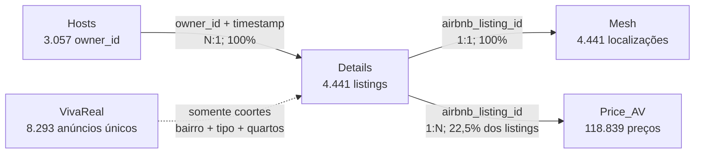

# Relacionamentos entre os arquivos

## Grafo validado

Não existe ligação individual validada entre Airbnb e VivaReal.

## Validação das relações documentadas

| Relação | Chaves reais | Cardinalidade | Cobertura | Registros órfãos | Risco analítico |
|---|---|---:|---:|---:|---|
| `Details → Hosts`, join bruto documentado | `Details.owner_id = Hosts.owner_id` | N:N no arquivo bruto | 100% dos 3.057 IDs em ambos | 0 anúncios por ID; 0 hosts por ID | Multiplica 4.441 anúncios para 30.822 linhas (6,94×). Não usar diretamente. |
| `Details → Hosts`, implementação segura descoberta | `(Details.owner_id, Details.aquisition_date) = (Hosts.owner_id, Hosts.host_snapshot_date)` | N:1 | 4.441/4.441 anúncios (100%) | 0 anúncios; 0 linhas de host sem par de captura relevante | Chave é válida neste snapshot; fora dele, revalidar. Reviews do host mudam durante a coleta para um host. |
| `Details → Mesh` | `airbnb_listing_id` em ambos | 1:1 | 4.441/4.441 (100%) nos dois lados | 0/0 | Coordenadas de `Details` são zeros; usar as de `Mesh`. Cinco bairros são a string `none`. |
| `Details → Price_AV` | `airbnb_listing_id` em ambos | 1:N | 999/4.441 em `Details` (22,5%); 999/1.005 IDs de preço (99,4%) | 3.442 listings sem preço; 6 IDs de preço sem listing, somando 509 linhas | Join multiplica anúncios; preço deve permanecer em grain longitudinal ou ser agregado antes. Cobertura seletiva por perfil/localização. |

### Implementação de `Hosts`

As 4.440 linhas de `Hosts` não são snapshots independentes de 4.440 anfitriões. Existem 3.057 hosts, e atributos são repetidos conforme listings são capturados. Há duas opções válidas:

1. usar a chave composta de captura para anexar o estado contemporâneo a cada listing;
2. criar uma dimensão de 3.057 hosts, escolhendo deterministicamente o último timestamp, quando a análise exigir apenas um valor por host.

A opção 1 preserva o vínculo observado e será o padrão. A opção 2 deve ser usada somente após teste de sensibilidade no único host com variação de reviews.

### Implementação de `Price_AV`

O grain seguro é `(airbnb_listing_id, date, capture_day)`, onde `capture_day` é a data extraída de `aquisition_date`. Não existem duplicações nessa chave. O timestamp completo não representa sozinho um snapshot: diferentes timestamps no mesmo dia particionam as datas de estadia.

Para métricas no nível do anúncio, primeiro agregar preço no grain definido e depois por listing. Fazer join longo diretamente e calcular médias de atributos de `Details` ponderaria listings com mais datas/capturas.

## Catálogo de relações adicionais

| Classe | Campos | Justificativa e cardinalidade/cobertura | Risco de falso relacionamento | Análises permitidas | Decisão |
|---|---|---|---|---|---|
| `DIRETA DESCOBERTA` | `Details.(owner_id, aquisition_date)` ↔ `Hosts.(owner_id, host_snapshot_date)` | Valores coincidem; N:1; cobre 4.441 anúncios | Baixo dentro deste snapshot; estabilidade futura não demonstrada | Atributos de gestão e host por listing sem explosão de linhas | **Usar**, revalidando a chave a cada execução |
| `DERIVADA` | `Price_AV.aquisition_date` → `capture_day` | A transformação por data produz grain listing–estadia–dia único | Baixo para organizar snapshots; médio para inferir disponibilidade | Mudança de preço, presença/ausência por captura e lead time | **Usar** como dimensão temporal, sem chamar ausência de reserva |
| `DERIVADA` | `Details → Hosts → Price_AV` via chaves validadas | Relação indireta listing–host–preço | Médio por cobertura de preço de 22,5% | Segmentar preços por experiência, superhost e gestão profissional | **Usar** com cobertura e tamanho amostral explícitos |
| `INVÁLIDA` | `Details.latitude/longitude` ↔ `Mesh.latitude/longitude` | Mesmos nomes, mas todas as coordenadas de `Details` são `0,0` | Certo: dados incompatíveis | Nenhuma | **Não usar** coordenadas de `Details` |
| `AGREGADA` | `Mesh.suburb` ↔ `VivaReal.suburb` | Oito nomes coincidem após casefold; outras diferenças são acento, grafia, subdivisões ou bairros exclusivos | Médio; normalização errada pode fundir regiões diferentes | Comparar preço de compra e proxy operacional por bairro | **Usar** após mapa determinístico, mantendo categoria original e casos não mapeados |
| `AGREGADA` | `Details.listing_type` ↔ `VivaReal.listing_type` | Apartamento, casa e outros existem em ambos; Airbnb também tem hotel, VivaReal tem terreno/comercial | Médio; “outros” não é necessariamente comparável | Comparar coortes residenciais por tipologia | **Usar** apenas para categorias residenciais explicitamente harmonizadas |
| `AGREGADA` | `Details.number_of_bedrooms` ↔ `VivaReal.bedrooms` | Contagens compartilhadas de 0 a 8 e 11 | Médio; zero pode ser studio, terreno ou campo não aplicável | Comparar preço e diária por quartos dentro de tipologia residencial | **Usar** junto com tipologia; validar zero quarto por texto |
| `AGREGADA` | bairro + tipologia + quartos | Coorte composta, não chave de imóvel | Médio/alto em segmentos pequenos; não identifica unidade | Gross yield proxy por segmento | **Usar** com tamanho mínimo, distribuição e intervalos |
| `DERIVADA` | `amenities` em cada mercado | Ambos armazenam listas, mas Airbnb usa descrições em português e VivaReal usa códigos em inglês | Alto se igualados diretamente | Características de receita no Airbnb; custos/atributos de compra no VivaReal | **Usar dentro de cada base**; não cruzar sem taxonomia documentada |
| `AGREGADA` | datas de captura de `Details`, `Price_AV` e `VivaReal` | Snapshots principais concentram-se em janeiro de 2025 | Baixo como contexto; alto como chave | Declarar contemporaneidade aproximada das bases | **Usar como contexto**, nunca como join |
| `INVÁLIDA` | `airbnb_listing_id` ↔ `VivaReal.listing_id` | Não há IDs literais compartilhados; namespaces são distintos | Certo | Nenhuma ligação individual | **Não usar** |
| `APROXIMADA` | título/descrição/bairro/quartos/tipologia | Campos textuais podem parecer semelhantes, mas não há endereço estável nem coordenada no VivaReal | Alto | Eventual pesquisa exploratória de candidatos, não inferência principal | **Não implementar agora** |
| `APROXIMADA` | `Mesh` geográfico ↔ bairro/título do VivaReal | VivaReal não fornece latitude/longitude | Muito alto para matching individual | No máximo validação manual futura | **Não usar** na análise principal |

## Dimensões agregadas que exigem normalização

- Acentos: `Alto Sao Bento`/`Alto São Bento`, `Sertaozinho`/`Sertãozinho`.
- Grafia: `Jardim Praiamar`/`Jardim Praia Mar`, `Varzea`/`Várzea` se aparecer.
- Variações que **não devem ser fundidas automaticamente**: `Meia Praia`, `Meia Praia - Frente Mar`, `Castelo Branco` e `Andorinha`; é necessário confirmar a semântica territorial.
- `Tabuleiro`, `Taboleiro` e `Tabuleiro dos Oliveiras` exigem decisão documentada; sem fonte cartográfica, manter separados.
- `none` e ausências devem permanecer como localização desconhecida.

## Decisão sobre matching Airbnb–VivaReal

Não realizar matching imóvel a imóvel. A ligação disponível é agregada por coortes harmonizadas. Qualquer comparação de retorno representará um imóvel típico de venda e uma operação típica de Airbnb no mesmo segmento, não o retorno histórico de uma unidade específica.

A comparabilidade permanece incompleta porque `Details` não contém área e `VivaReal` não contém capacidade de hóspedes. Mesmo dentro de bairro × tipologia × quartos, padrão e tamanho podem diferir.
